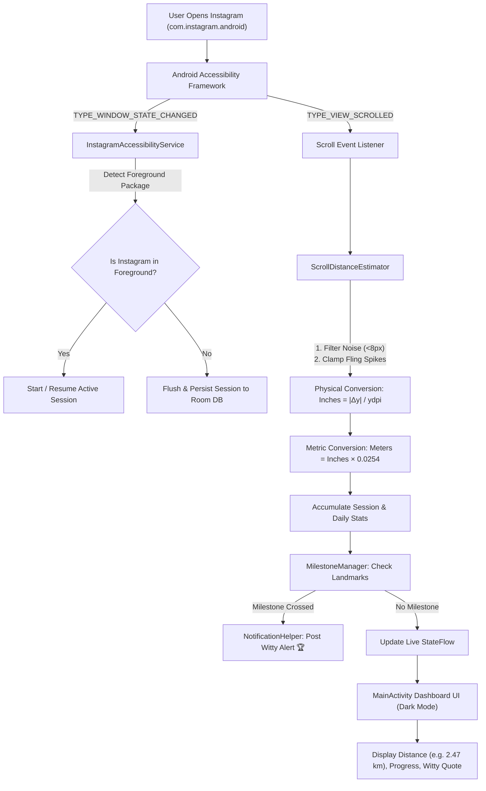

# ScrollMeter 📏🎯

> "You've scrolled 2.47 km on Instagram today... without ever leaving your chair."

ScrollMeter is an Android mobile app and background tracking service that measures the user's estimated vertical scrolling distance while they use Instagram and converts that distance into funny, relatable real-world metrics (meters, kilometers, landmarks, and marathon distances).

---

## Basic Details

### Team Name: LazyMarathoners

### Team Members
- Team Lead: Muhammed Hisham Hazain

### Project Description
ScrollMeter silently tracks your Instagram scrolling activity in the background using Android's native AccessibilityService. It estimates the physical vertical distance your thumb has scrolled, compares it with real-world landmarks (like crossing a street, scaling the Eiffel Tower, or running a 5K), and sends witty milestone alerts to encourage you to put the phone down and touch some grass 🌱.

### The Problem (that doesn't exist)
Modern humans spend hours every day performing Olympic-level thumb endurance marathons through social media feeds, yet fitness trackers refuse to count thumb-swipes toward daily steps or cardio goals. The extreme injustice of scrolling 5 kilometers through reels without getting credit on Apple Health or Strava must be resolved.

### The Solution (that nobody asked for)
ScrollMeter bridges this crucial gap by measuring the exact physical distance of your Instagram doomscrolling. By mapping screen pixel displacements to device physical DPI, it gives you exact odometer metrics: *"You scrolled 1.8 km on Instagram today — congratulations, you walked to the nearest coffee shop with your index finger!"*

---

## Technical Details

### Technologies/Components Used

For Software:
- **Languages:** Kotlin (Android Native), JavaScript (ES6+ for interactive simulator), HTML5, CSS3
- **Frameworks/Architecture:** Android Jetpack (Lifecycle, ViewModel, StateFlow, Coroutines), Android AccessibilityService API, Room Database (SQLite ORM), Material Design 3
- **Libraries:** AndroidX Core KTX, AndroidX AppCompat, Material Components, Room KTX, JUnit 4
- **Tools:** Android Studio, Gradle (Kotlin DSL), Git, GitHub

### Platform Limitations & Legal Privacy Design

1. **Why Android Native (`AccessibilityService`):**
   - On iOS, third-party apps run in strict sandboxes and are strictly prohibited by Apple from monitoring screen touches, gestures, or foreground app states of other third-party apps.
   - On Android, `android.accessibilityservice.AccessibilityService` is the legitimate, official operating system API for monitoring window transitions and scroll gestures.
2. **Physical Conversion Math:**
   - Real screen DPI is obtained via `DisplayMetrics.ydpi`.
   - Distance formula:
     $$\text{Physical Inches} = \frac{|\Delta y|}{\text{ydpi}}, \quad \text{Distance in Meters} = \text{Physical Inches} \times 0.0254$$
3. **100% Privacy & Local-First:**
   - `canRetrieveWindowContent` is explicitly configured to `false`.
   - ScrollMeter **never** reads on-screen text, post captions, direct messages, photos, contacts, or passwords.
   - All session data is stored 100% locally in an on-device SQLite/Room database. No remote servers, no trackers.

---

## Implementation

### For Software:

#### Android Native Project Installation & Build:
```bash
# Navigate to the Android project directory
cd android

# Build debug APK with Gradle
./gradlew assembleDebug

# Run unit tests (DPI conversion, noise filtering, milestone logic)
./gradlew test
```

#### Run Interactive Web Companion & Simulator:
```bash
# Start a local web server from the repository root
python3 -m http.server 8080

# Open in browser:
# http://localhost:8080
```

---

## Project Documentation

### Architecture & Workflow Diagram



### Landmarks & Milestones

| Distance | Milestone Title | Relatable Real-World Comparison | Emoji |
| :--- | :--- | :--- | :---: |
| **25 m** | Olympic Pool | Swam the length of an Olympic swimming pool with your thumb | 🏊 |
| **100 m** | Crossed The Street | You crossed a city street without looking up from your phone | 🚶 |
| **300 m** | Eiffel Tower | Scaled the full vertical height of the Eiffel Tower | 🗼 |
| **828 m** | Burj Khalifa | Reached the pinnacle of the world's tallest skyscraper | 🏙️ |
| **1.0 km** | 1 Kilometer Club | You walked an entire kilometer without moving a single leg muscle | 🦥 |
| **2.5 km** | Coffee Run | Distance from your house to the nearest specialty coffee shop | ☕ |
| **5.0 km** | 5K Park Run | A healthy 5K run... accomplished entirely from your couch | 🏃 |
| **8.85 km** | Mount Everest | You just vertically summitted Mount Everest from bed | 🏔️ |
| **10.0 km** | Touch Some Grass | Over 10 km scrolled. Please put down your phone and touch some grass | 🌱 |
| **21.1 km** | Half Marathon | Half marathon territory. Your thumb has 6-pack abs | 🎽 |
| **42.2 km** | Full Marathon | You completed an entire 42.195 km Olympic Marathon on Instagram! | 🏅 |

---

## Team Contributions

- **Muhammed Hisham Hazain**:
  - Android `InstagramAccessibilityService` background lifecycle and package detection implementation
  - `ScrollDistanceEstimator` physics conversion engine with screen DPI scaling and jitter filtering
  - Room database schema (`ScrollSession`, `DailyStat`) and statistics calculation module
  - Notification management and milestone landmark comparisons
  - Interactive web companion and Instagram feed simulator UI in dark mode

---

Made with ❤️ at TinkerHub Useless Projects


